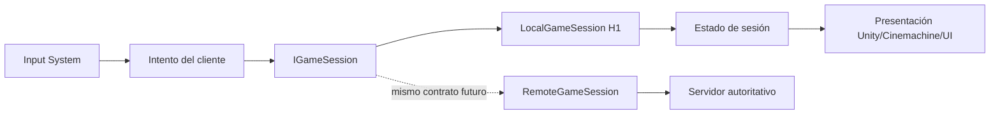

# Lumbre de Nácar — Arquitectura inicial

## Principio

El proyecto comienza offline para iterar rápido, pero la presentación nunca decide por sí sola un resultado persistente. Las reglas se mantienen en assemblies sin `UnityEngine` y la sesión es una frontera reemplazable.

## Capas

| Capa | Assembly | Responsabilidad | Dependencias permitidas |
| --- | --- | --- | --- |
| Dominio | `Game.Domain` | Estado y tipos conceptuales puros | BCL mínima |
| Aplicación | `Game.Application` | `IGameSession`, comandos, eventos y resultados | `Game.Domain` |
| Cliente | `Game.Client` | MonoBehaviours, escenas, input, UI, movimiento, presentación y composición offline | Unity, `Game.Application`, `Game.Domain`, `Game.Infrastructure.Local` |
| Infraestructura local | `Game.Infrastructure.Local` | Sesión local y persistencia JSON del slice | `Game.Application`, `Game.Domain` |
| Tests | `Game.Tests.*` | Pruebas de contratos y ejecución | assemblies bajo prueba + Test Framework |

## Flujo de sesión

En H3/H4B/H5/H6 el flujo queda así: dispositivo → `H3PlayerInputReader` → `MovementIntent` → `H3PlayerController` → `Rigidbody2D`/colisiones → Cinemachine. El ataque sigue un flujo separado: botón/teclado → `H4PlayerCombatController` → `IAttacker` → `ITargetable`/`IDamageable` → `IHealth` → feedback. Las habilidades siguen: input → `H4BPlayerAbilityController` → modelos puros de Calor/defensa/área → adaptador de objetivos/feedback. La onda sigue: IA común → `ResonantWaveAttackModel` → telegraph → resolución de daño. La misión sigue: muerte de combate → `H5CombatEventBridge` → `DomainEventBus` → `H5MissionModel` → inventario/equipamiento → HUD. La progresión sigue: evento de derrota/recompensa → `H6ProgressionModel` → XP/nivel → `ExperienceGainedEvent`/`LevelUpEvent` → HUD y `ISaveRepository`. El dominio no conoce Unity ni el dispositivo de entrada.

## Capas oficiales de escena

| Layer | Uso | Regla H3 |
| --- | --- | --- |
| `WorldGround` (8) | Meshes de plaza, sendero y cueva | Solo representación del suelo greybox |
| `WorldObstacle` (9) | Límites y celdas bloqueadas | Colisiona con `Player` |
| `Player` (10) | Avatar y visual | Única entidad móvil de H3 |
| `PlayerRespawn` (11) | Punto de retorno | No participa como obstáculo |
| `NavigationDebug` (12) | Preview y herramientas de navegación | Editor/debug, no gameplay |
| `PlayerUI` (13) | Canvas y joystick móvil | Presentación, no reglas de mundo |
| `Enemy` (14) | Mordeluz y sus visuales | Objetivo de combate; no bloquea físicamente al jugador |

Las capas se declaran en `Game.Domain/Constants/ProjectLayers.cs` y se aplican al construir la escena. `GreyboxDebugGizmos` dibuja información de depuración sin añadir objetos de navegación al runtime. `Enemy` ignora la colisión física con `Player` para que una criatura no bloquee la navegación; el alcance y el estado de IA siguen validando el combate.

## Migración offline → online

1. Mantener las reglas puras y versionar comandos/eventos.
2. Convertir `LocalGameSession` en un adaptador de pruebas, no en la fuente definitiva de economía.
3. Añadir una `RemoteGameSession` que envíe intenciones y reciba snapshots/eventos autorizados.
4. Recalcular en servidor movimiento válido, daño, XP, oro, botín, misión e inventario.
5. Hacer que el cliente interpole y presente estado recibido; nunca aceptar del cliente el resultado final de una recompensa.
6. Migrar el guardado local solo como importación explícita y revisable, nunca como autoridad automática.

## Decisiones que evitan deuda temprana

- Sin Singleton global de gameplay.
- Sin referencias de `UnityEngine` en dominio/aplicación.
- Sin `Resources` ni Addressables durante H1.
- Sin IDs generados por posición de escena para entidades persistentes.
- Sin API de tienda, VIP o economía en el cliente.
- Sin implementar una abstracción de red antes de tener un slice offline medible.
- El reloj de combate se inyecta mediante `ICombatTimeSource`; el cliente usa `UnityCombatTimeSource` y los tests controlan el tiempo manualmente.
- El progreso de H5 usa eventos de dominio y IDs estables de entidad; la recompensa se valida dentro del modelo de misión, no desde el HUD ni el botón de interacción.
- El runtime cliente compone temporalmente `JsonFileSaveRepository` desde `Game.Infrastructure.Local`; el contrato visible para la aplicación es `ISaveRepository`, por lo que un adaptador remoto puede sustituirlo sin serializar `MonoBehaviour` ni mover reglas al cliente.
- Los DTOs de `Game.Domain.Persistence` contienen solo datos primitivos, listas e IDs estables. La conversión a JSON y el acceso a `Application.persistentDataPath` quedan fuera del dominio.

## Presentación H7

H7 añade una capa de presentación dentro de `Game.Client/Presentation` sin convertirla en autoridad de juego:

- `H7CharacterView` traduce movimiento, ataques, daño, muerte, habilidades y estados de IA a clips Animator.
- `H7PresentationRuntime` escucha resultados de combate, eventos de misión, recompensa, equipamiento y nivel para disparar feedback.
- `H7VfxPool` prewarmiza efectos y limita la cantidad activa; `H7AudioFeedback` mantiene fuentes de one-shot y ambientes por zona.
- `H7StatusHud` solo lee salud, Calor, XP, misión, inventario y equipamiento; `H7NaraPresentation` solo presenta proximidad y estado de misión.
- `H7CameraPolish` opera sobre la cámara Cinemachine oficial con offsets temporales; no cambia el target ni la simulación.
- `H7PresentationBuilder` mantiene el scene graph de H3–H6 y permite reconstruir la presentación de forma idempotente.

El arte base se importa como SpriteRenderer, pero el grid lógico, los colliders, la navegación, el respawn y las capas oficiales siguen siendo los contratos de gameplay. La presentación puede reemplazarse por una futura capa de arte final o por una vista remota sin mover modelos puros ni DTOs.

## Optimización y UX H8

H8 amplía únicamente la presentación y las herramientas de validación:

- `H8LocalSettings` guarda preferencias de música, FX, vibración, calidad y diagnósticos en `PlayerPrefs`; no comparte claves ni formato con el save de partida de H6.
- `H8PauseController` compone pausa, opciones y salida sobre el Canvas de `PlayerUI`; modificar el tiempo global solo es una preocupación de presentación y se restaura al destruir el controlador.
- `H8PerformanceOverlay` lee contadores de Unity con `ProfilerRecorder` y solo muestra datos cuando QA activa FPS o debug. No concede estado ni modifica simulación.
- `H8Tooltip` comparte un único panel de ayuda contextual para evitar una colección de ventanas y Canvas adicionales.
- `H8OptimizationBuilder` mantiene la escena idempotente, limita configuración visual y no toca `Game.Domain`, `Game.Application`, los modelos de combate, misión, progresión o persistencia.

La frontera sigue siendo: dominio/aplicación deciden estado; infraestructura local lo persiste; cliente y presentación presentan. H8 no introduce autoridad paralela, red, Addressables ni una abstracción de configuración dentro del dominio.

## Pulido de vertical slice H9

H9 mantiene la misma frontera y solo refina la presentación existente:

- `H9SafeAreaLayout` contiene la raíz de `PlayerUI` dentro de `Screen.safeArea`; controles, HUD y menús continúan siendo consumidores de los mismos contratos H3–H8.
- `H9VerticalSlicePolishBuilder` es idempotente y modifica únicamente jerarquía/layout UI, parámetros de Cinemachine, collider de límites visuales y versión de presentación.
- El builder sincroniza el offset de composición tanto en `CinemachineFollow` como en `H3CinemachineFollowTarget`, evitando que el binding de H3 sobrescriba la configuración H9 durante `Awake`.
- `H7CameraPolish` conserva el target oficial y aplica composición, amortiguación y zoom sin decidir movimiento ni colisiones.
- `H7StatusHud` y `H5MissionHud` siguen leyendo estado de combate, misión, inventario y progresión; el segundo solo muestra prompts contextuales y nunca ejecuta reglas.
- La preparación Android usa `PlayerSettings`/BuildPipeline y una captura física solo se considera válida cuando proviene de un dispositivo conectado, no de una simulación del editor.

No se añaden sistemas de servidor, networking, economía, drops, misiones, habilidades ni nuevos actores. La migración offline → online definida arriba permanece intacta.

## Riesgos pendientes

La interfaz de sesión no define aún serialización, autenticación, reconciliación, tick rate ni transporte. Es intencional: esas decisiones pertenecen al spike online posterior a la demo y no deben simularse en H9. Los modelos de combate, habilidades, misión, inventario y progresión son puros y el cliente solo los adapta; una futura sesión autoritativa deberá recalcular Calor, cooldown, duración, daño, salud, muerte, progreso, XP, nivel, entrega y equipamiento en servidor. El save local y las preferencias H8 quedan como formatos locales de transición controlada, no como autoridad online.
